# Authenza — Complete Application Flow Diagrams

---

## 1. System Architecture

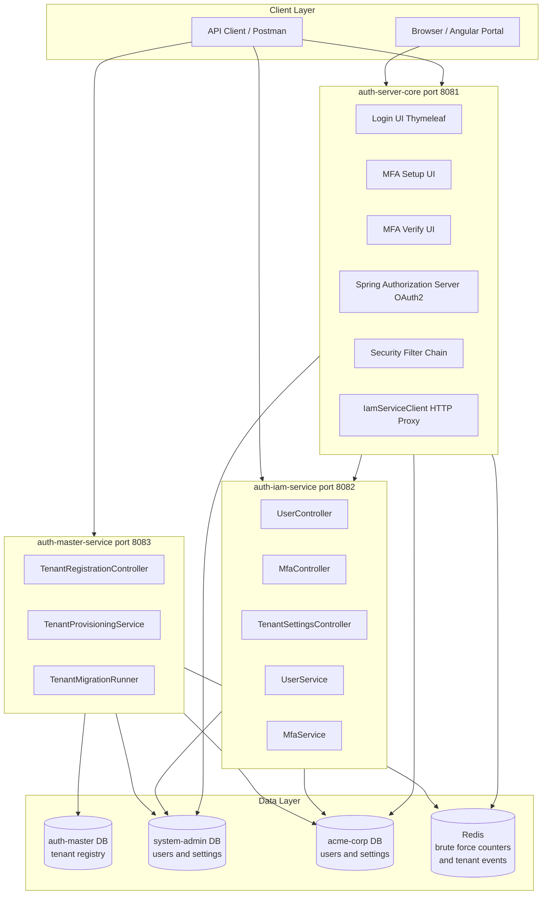

---

## 2. Tenant Provisioning Flow

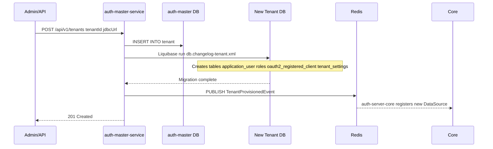

---

## 3. User Registration Flow

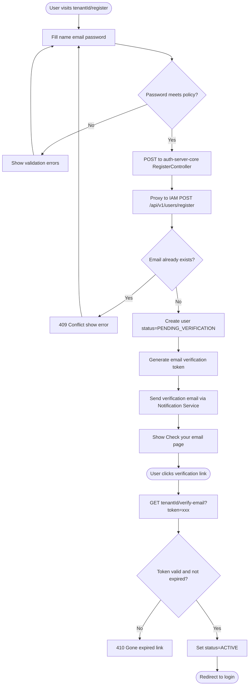

---

## 4. Login Flow with Brute Force Protection

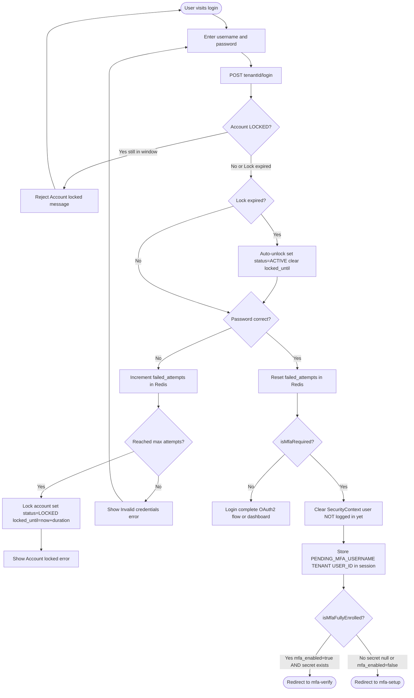

---

## 5. MFA Enrollment Flow Setup

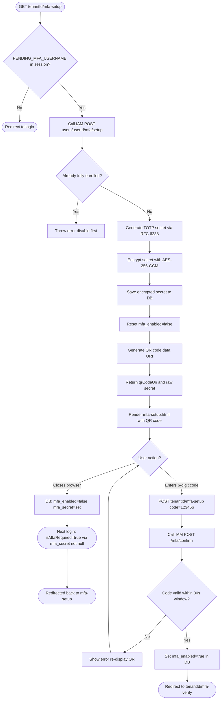

---

## 6. MFA Login Challenge Flow Verify

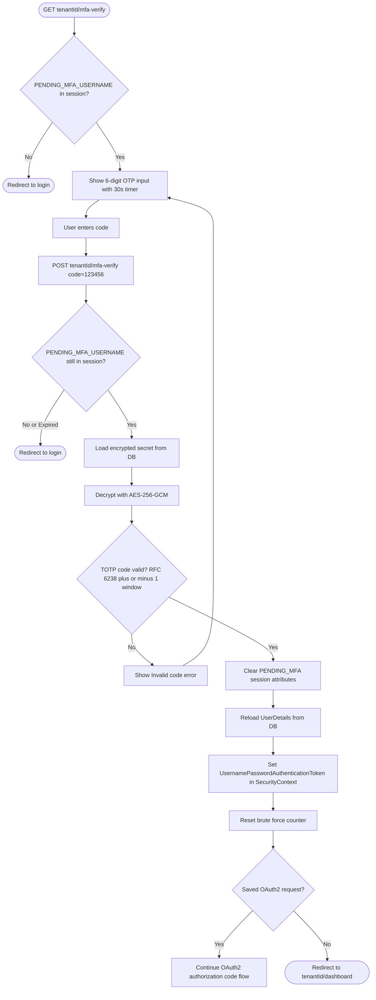

---

## 7. MFA Disable Flow

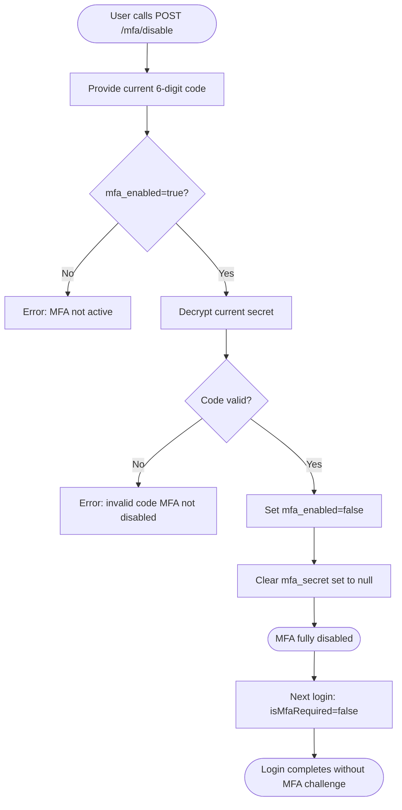

---

## 8. OAuth2 Authorization Code + PKCE Flow

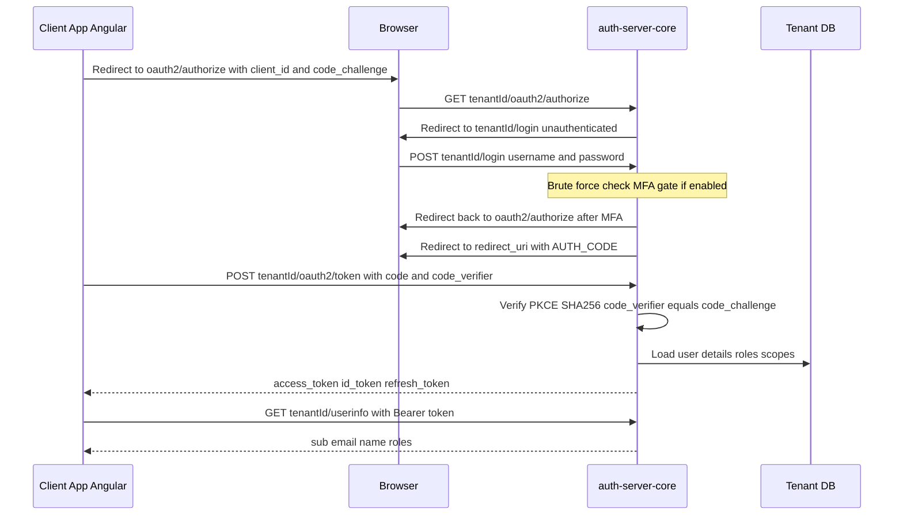

---

## 9. Password Reset Flow

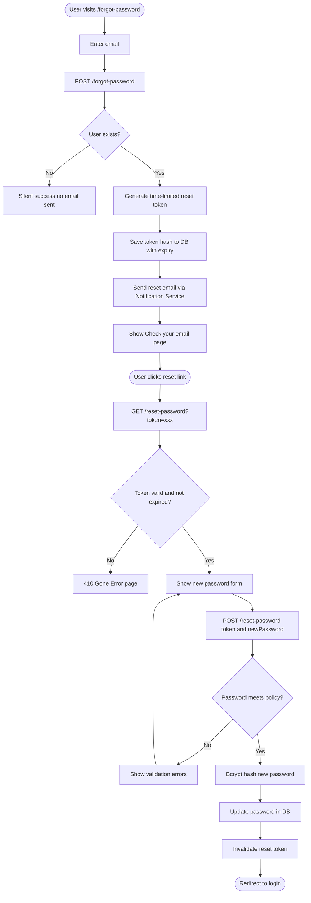

---

## 10. Tenant MFA Policy Management

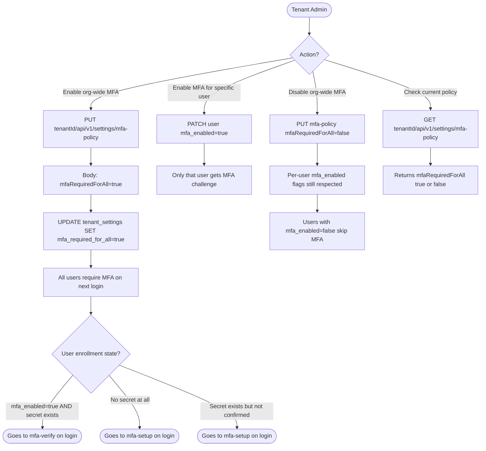

---

## 11. MFA State Machine

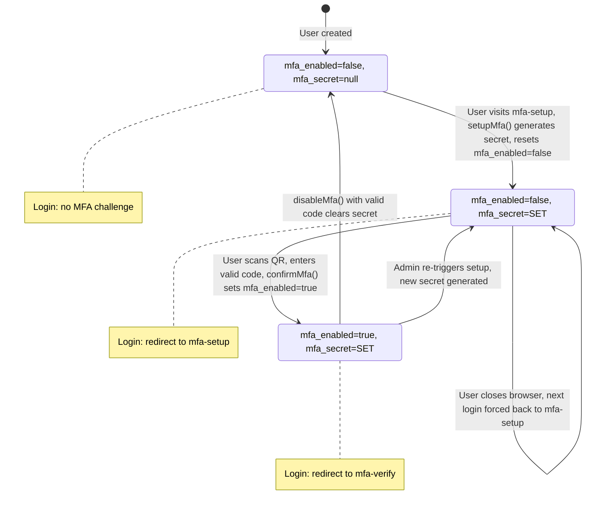
