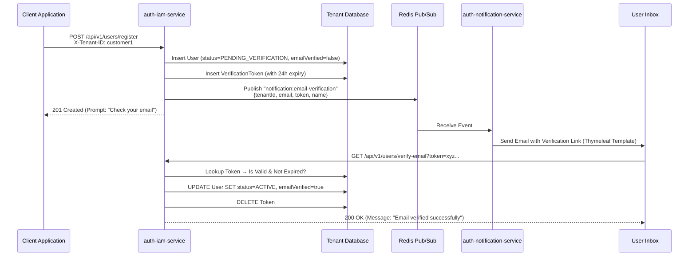

# User Registration & Email Verification Flow

## Architecture Context

The Authenza platform uses a multi-module architecture. The user registration and email verification flow spans across several of these modules to ensure clean separation of concerns:

- **auth-tenant-schema:** Manages the database schema, including the new verification token table.
- **auth-iam-service:** Handles the core business logic for user registration, token generation, and verification.
- **auth-common:** Hosts shared models and Redis channel constants.
- **auth-notification-service:** Listens for asynchronous events and sends branded emails using tenant-specific SMTP configurations.
- **auth-server-core:** Acts as the gatekeeper, preventing logins for users whose email addresses remain unverified.

---

## End-to-End Execution Flow



---

## Implementation Steps & Module Mapping

### 1. Database Schema (`auth-tenant-schema`)
Create a new Liquibase changeset to introduce the `email_verification_token` table within the tenant schema. This table securely stores the randomly generated tokens.

```xml
<changeSet id="010-create-email-verification-token" author="admin">
    <createTable tableName="email_verification_token">
        <column name="id" type="BIGINT" autoIncrement="true">
            <constraints primaryKey="true" nullable="false"/>
        </column>
        <column name="user_id" type="BIGINT">
            <constraints nullable="false"/>
        </column>
        <column name="token" type="VARCHAR(255)">
            <constraints nullable="false" unique="true"/>
        </column>
        <column name="token_type" type="VARCHAR(30)" defaultValue="EMAIL_VERIFICATION">
            <constraints nullable="false"/>
        </column>
        <column name="expires_at" type="TIMESTAMP">
            <constraints nullable="false"/>
        </column>
        <column name="created_at" type="TIMESTAMP" defaultValueComputed="CURRENT_TIMESTAMP">
            <constraints nullable="false"/>
        </column>
    </createTable>

    <addForeignKeyConstraint
        baseTableName="email_verification_token"
        baseColumnNames="user_id"
        referencedTableName="application_user"
        referencedColumnNames="id"
        constraintName="fk_verification_token_user"
        onDelete="CASCADE"/>
</changeSet>
```

### 2. Domain Models & Repositories (`auth-iam-service`)
Create the Java entity representing the `email_verification_token` table and its corresponding Spring Data JDBC repository.

- **Entity Check:** Include an `isExpired()` helper method in the model.
- **Repository Operations:** Include methods for `findByToken(String token)` and cleanup queries like `deleteByUserId(Long userId)`.

### 3. Registry API Updates (`auth-iam-service`)
Update the `UserService.registerUser()` implementation:
1.  **Mark PENDING:** Initialize the newly created user with `status = "PENDING_VERIFICATION"` and `emailVerified = false`.
2.  **Generate Token:** Generate a secure token (e.g., `UUID.randomUUID().toString()`) and save it via the `VerificationTokenRepository`.
3.  **Publish Event:** Publish an asynchronous event to Redis containing the recipient's details and the token.

### 4. Verification Endpoint (`auth-iam-service`)
Expose a public endpoint for the user to click:
`GET /api/v1/users/verify-email?token={token}`

**Logic:**
1. Fetch the token. If missing, throw an exception.
2. Check if `isExpired()`. If true, delete the token and suggest the user request a new one.
3. Fetch the associated user.
4. Update user `status = "ACTIVE"` and `emailVerified = true`.
5. Delete the used verification token.

### 5. Event Publishing (`auth-common` & `auth-iam-service`)
Define a shared channel constant in `auth-common` (e.g., `RedisChannels.NOTIFICATION_EMAIL_VERIFICATION`). Modify `auth-iam-service` to serialize a payload (tenant ID, email, name, token) and publish it to this Redis channel.

### 6. Email Delivery (`auth-notification-service`)
Add an event listener for the new Redis channel.
1.  **Construct URL:** Build the complete verification URL utilizing the frontend base URL or API base URL.
2.  **Bind Template:** Pass the variables (`userName`, `verificationUrl`) to a Thymeleaf HTML document.
3.  **Send:** Dispatch the email using the tenant's dynamically resolved SMTP settings over the `DynamicMailSenderFactory`.

### 7. Enforcing the Gate (`auth-server-core`)
Update the authentication provider logic. Before issuing an OAuth2 token during the login sequence, inspect the `status` and `emailVerified` claims. If unverified, reject the authentication request with a clear message: `"Please verify your email address to proceed."`

---

## Security Best Practices
- **Predictable Tokens:** Always utilize non-sequential, highly entropic generators like `UUID.randomUUID()` or `java.security.SecureRandom`.
- **One-Time Use:** Tokens must be invalidated immediately upon successful verification.
- **Lifespan Constraints:** Standard expiration time for a verification link is between 15 minutes and 24 hours. Ensure stale tokens are purged routinely.
- **Rate Limiting (Optional):** If implementing a "Resend Verification Email" endpoint, ensure it is rate-limited per user to prevent SMTP abuse.
