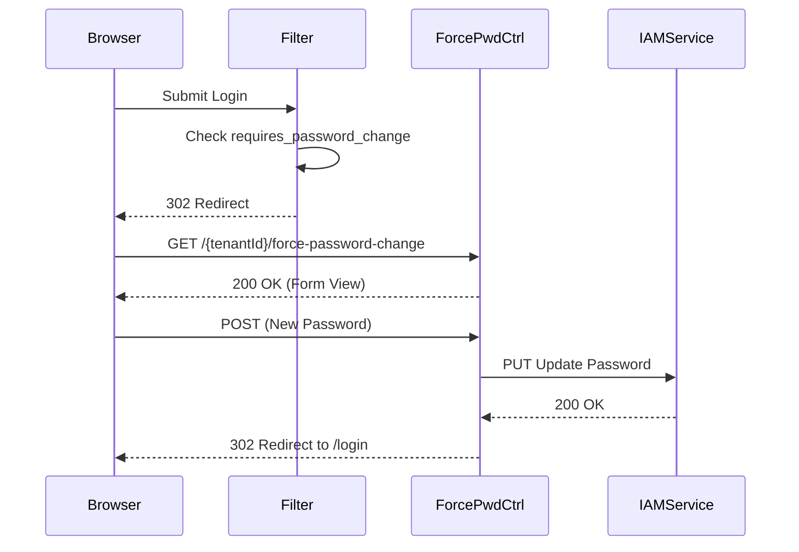

# ForcePasswordChangeController E2E Architecture Flow

## Overview
The `ForcePasswordChangeController` (located in `auth-server-core`) manages the specific scenario where an administrator has flagged a user account as requiring a password change (e.g., after assigning a temporary password).

## Flow Diagram & Description

### 1. The Intercept
- This controller is deeply integrated with the login flow. When a user authenticates successfully (either via form login or passkey), the security engine checks if `requires_password_change` is true in the database.
- If true, the authentication context is *not* completed. Instead, the user's identity is temporarily stored in the `HttpSession` (`PENDING_PASSWORD_CHANGE_USERNAME`), and they are redirected to `/{tenantId}/force-password-change`.

### 2. Rendering the Form (`GET /{tenantId}/force-password-change`)
- **Gate Check:** The controller checks the `HttpSession`. If the `PENDING_PASSWORD_CHANGE_USERNAME` attribute is missing, the user is immediately redirected back to `/login`. This prevents users from navigating to this page directly.
- **Result:** Renders the forced password update view.

### 3. Processing the Change (`POST /{tenantId}/force-password-change`)
- **Action:** Captures the new password.
- **Validation:** Ensures the new and confirm passwords match.
- **Proxying:** Calls the IAM service via `IamServiceClient.forceChangePassword()` using the `userId` retrieved from the secure session state.
- **Completion:** If successful, it clears the temporary session attributes and redirects the user back to `/login?passwordChanged=true`, forcing them to re-authenticate with their new credentials.

## Security Considerations
- **Session Gating:** This flow is impossible to enter without first successfully proving identity via the primary authentication mechanisms (password or passkey).
- **Incomplete Context:** The user is *not* granted an OAuth2 token or a full `SecurityContext` until they successfully update their password and log in again.

## Request to Response Design Flow

### 1. Force Password Update Flow

