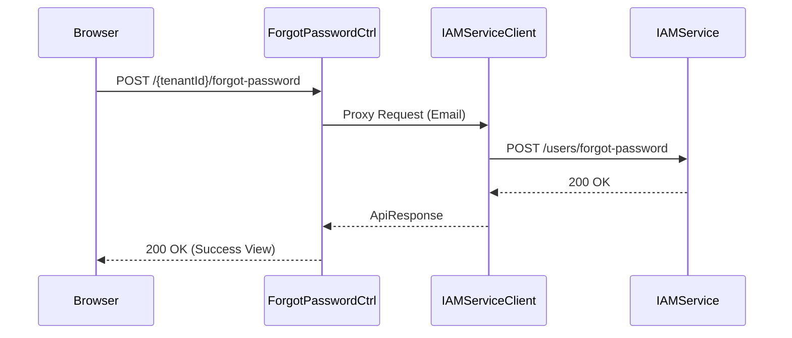

# ForgotPasswordController E2E Architecture Flow

## Overview
The `ForgotPasswordController` (located in `auth-server-core`) serves the Thymeleaf pages for the self-service password recovery flow and proxies requests to the `auth-iam-service`.

## Flow Diagram & Description

### 1. Requesting a Reset Link (`POST /{tenantId}/forgot-password`)
- **Action:** Captures the user's email address from the UI.
- **Proxying:** Forwards the request to `IamServiceClient.requestPasswordReset()`, which generates the token and sends the email from the backend.
- **Anti-Enumeration:** The controller *always* returns a success message to the UI ("If an account exists, a link was sent"), regardless of whether the email was found in the database. This prevents attackers from guessing valid email addresses.

### 2. Rendering the Reset Form (`GET /{tenantId}/reset-password`)
- **Action:** When the user clicks the email link, they hit this endpoint with a `?token=...` parameter.
- **Pre-Validation:** Before rendering the "New Password" form, the controller calls the IAM service (`IamServiceClient.validateResetToken()`) to ensure the token is still valid (not expired or already used).
- **Result:** If valid, renders the form. If invalid, renders an error state.

### 3. Processing the New Password (`POST /{tenantId}/reset-password`)
- **Action:** Captures the new password.
- **Local Validation:** Ensures `newPassword` matches `confirmPassword` and meets basic length requirements locally.
- **Proxying:** Submits the token and the new password to the IAM service to securely update the database hash.
- **Result:** Displays a success message prompting the user to sign in.

## Security Considerations
- **CSRF Protection:** Eagerly instantiates CSRF tokens to prevent form-hijacking.
- **Anti-Enumeration:** Standard security practice implemented in the POST request logic.

## Request to Response Design Flow

### 1. Request Reset Link Flow

