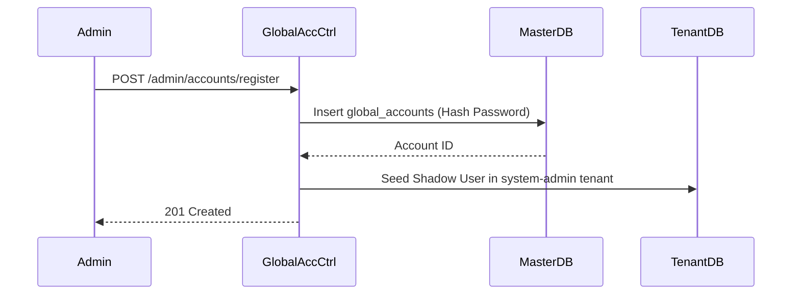
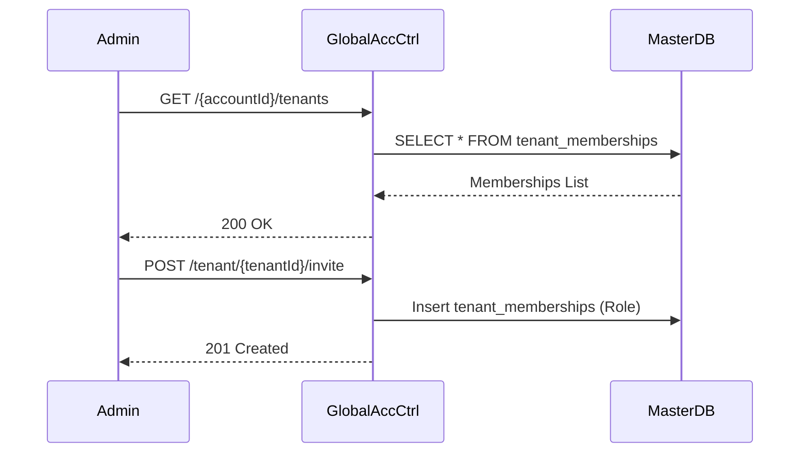

# GlobalAccountController E2E Architecture Flow

## Overview
The `GlobalAccountController` (located in `auth-master-service`) manages the platform-level administrative identities known as "Global Accounts." These accounts are stored in the master database and represent SaaS administrators who can own or manage one or more tenant organizations.

## Flow Diagram & Description

### 1. Registering a Global Account (`POST /admin/accounts/register`)
- **Action:** Creates a new administrative identity in the `global_accounts` table.
- **Provisioning Link:** After successfully registering the account, it automatically invokes the `TenantProvisioningService` to seed a "Shadow User" for this account into the `system-admin` tenant database. This ensures the global admin has a concrete representation in the master IAM realm.

### 2. Tenant Context Switching (`GET /{accountId}/tenants`)
- **Action:** Retrieves all `TenantMembership` records for a specific global account.
- **Use Case:** This powers the "Switch Organization" dropdown in the portal UI, allowing an administrator who belongs to multiple tenants to view their accessible scopes.

### 3. Tenant Member Management (`GET /tenant/{tenantId}/members`)
- **Action:** Retrieves a list of all global accounts that have access to a specific tenant.
- **Use Case:** Powers the "Tenant Members" administrative tab.

### 4. B2B Collaboration (`POST /tenant/{tenantId}/invite`)
- **Action:** Allows an existing admin to invite another registered global account to collaborate on their tenant.
- **Result:** Creates a new linkage in the `tenant_memberships` table, binding the invitee to the target tenant with a specific platform role.

## Security Considerations
- **Master Database Isolation:** This controller exclusively queries the master schema. It never interacts with tenant-specific databases directly (other than triggering the initial shadow-user seeding).
- **Future Hardening:** Currently lightly protected, these endpoints will be secured by M2M Client Credentials using the `system-admin` OAuth2 scope (Phase 5 of the Roadmap).

## Request to Response Design Flow

### 1. Global Account Registration

### 2. Tenant Context & Collaboration

