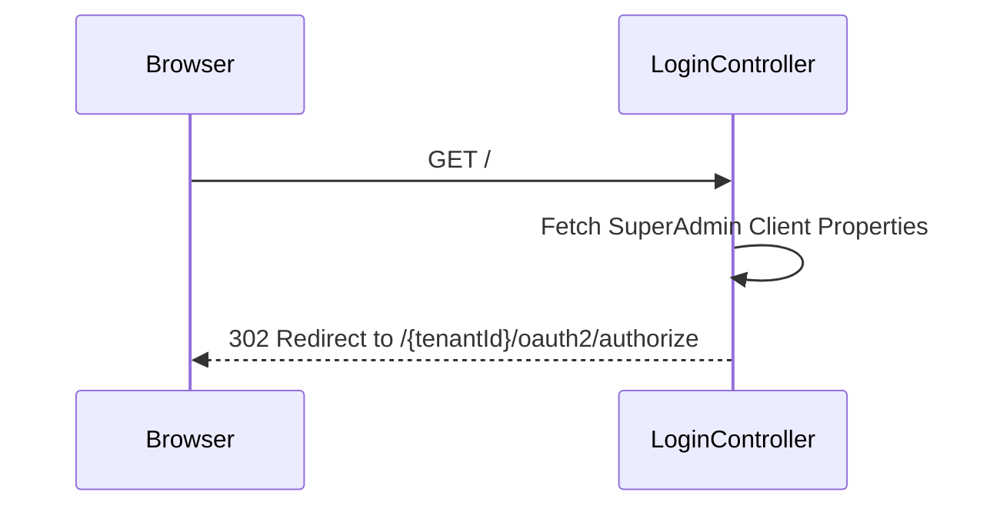
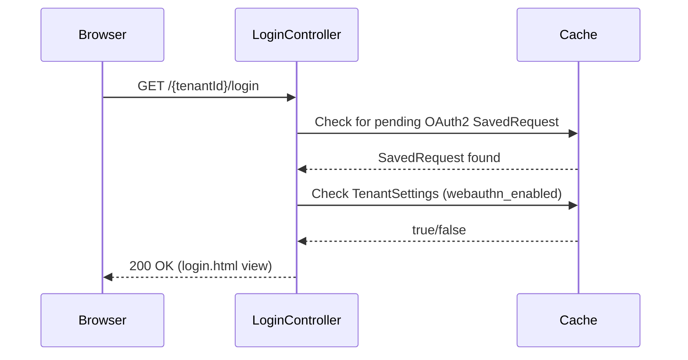

# LoginController E2E Architecture Flow

## Overview
The `LoginController` (located in `auth-server-core`) acts as the entry point and router for the authentication experience. Its primary responsibility is managing the redirection flow between the application's root URL, the multi-tenant login page, and the OAuth2/OpenID Connect (OIDC) authorization engine.

## Flow Diagram & Description

### 1. Root Redirection (`GET /`)
When a user navigates to the bare domain (e.g., `http://auth.authenza.com/`), they hit the `rootRedirect()` method.
- **Action:** The controller reads the `SuperAdminClientProperties` to obtain the system's "first-party" `system-admin` client details (Tenant ID, Client ID, Scopes, Redirect URIs).
- **Redirection:** It dynamically constructs a standard OAuth2 `/authorize` URL (e.g., `/{tenantId}/oauth2/authorize?response_type=code&client_id=...`) and issues a 302 Redirect.
- **Why?** This ensures that even "direct" visits to the auth server are properly wrapped in a secure OIDC Authorization Code flow, preventing users from accessing the login page without a valid OAuth2 context.

### 2. Login Page Rendering (`GET /{tenantId}/login`)
This is the main endpoint that serves the login HTML view.
- **State Check:** If the user is *already authenticated* (and not anonymous), they are immediately redirected away. This prevents users from hitting the "Back" button into a login form when they already have an active session.
- **Context Validation:** The controller uses Spring's `HttpSessionRequestCache` to check if there is a pending `SavedRequest`. A `SavedRequest` proves the user arrived here via the `/oauth2/authorize` endpoint.
  - If *no* `SavedRequest` is found (and no `?error` or `?logout` flags exist), the user navigated here directly. The controller blocks them with an `Unauthorized Access` error page, stating that login must be initiated via an OAuth2 client.
- **Feature Flags:** It queries the `TenantSettingsCache` to determine if `webauthn_fingerprint_enabled` is true for this specific tenant, passing this boolean to the UI model to conditionally render the "Sign in with Passkey" button.
- **Result:** Renders the `login.html` Thymeleaf template.

### 3. Authenticated User Redirection (`getAuthenticatedUserRedirect`)
If an already-logged-in user hits the login page, the controller determines where to send them:
1. **OAuth2 Client Resolution:** It extracts the `client_id` from the cached `SavedRequest`, looks up the `RegisteredClient` in the database, and redirects them to the client's registered base URL (e.g., the tenant portal).
2. **System Admin Fallback:** If they belong to the `system-admin` tenant, they are redirected to `/`.
3. **Referer Header:** If all else fails, they are sent back to the URL in the `Referer` HTTP header.

### 4. Invalid Tenant Handling (`GET /error/invalid-tenant`)
If the `MultiTenantSecurityFilter` or OIDC engine detects an invalid `tenantId` in the path, it redirects here.
- **Action:** Renders a user-friendly error page (`error-page.html`) indicating the tenant was not found.

## Security Considerations
- **No Direct Access:** By enforcing the `HttpSessionRequestCache` check, the controller guarantees that every login attempt is cryptographically bound to a valid OAuth2 client request (with proper `state` and `nonce` parameters).
- **Session Bleed Prevention:** The `tenantId` is strictly bound to the path variable, ensuring the login UI is customized and sandboxed for the specific tenant requested.

## Request to Response Design Flow

### 1. Root Redirection

### 2. Login Page Rendering

