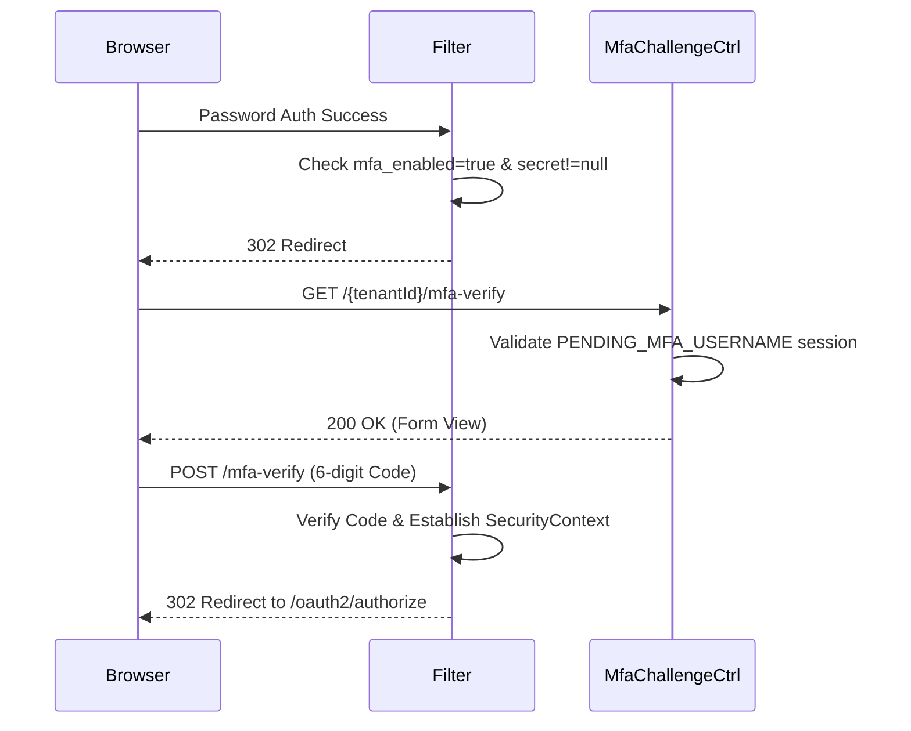

# MfaChallengeController E2E Architecture Flow

## Overview
The `MfaChallengeController` (located in `auth-server-core`) is a lightweight presentation controller responsible for serving the Thymeleaf view where users input their TOTP code during a standard MFA login flow.

## Flow Diagram & Description

### 1. The Intercept
- When a user logs in (via `LoginController` / Spring form login) and the system detects that `mfa_enabled` is true AND an `mfa_secret` exists, the `MfaAuthenticationFilter` pauses the authentication.
- It stores `PENDING_MFA_USERNAME` in the `HttpSession` and redirects to `/{tenantId}/mfa-verify`.

### 2. Rendering the Challenge (`GET /{tenantId}/mfa-verify`)
- **Gate Check:** The controller checks the `HttpSession`. If the `PENDING_MFA_USERNAME` attribute is missing, the user is immediately redirected back to `/login`. This prevents attackers from skipping the primary password factor.
- **Action:** Eagerly forces the generation of a CSRF token.
- **Result:** Renders the `mfa-verify.html` view.

### 3. Processing the Challenge (Handled by Filter)
- **Note:** This controller *does not* have a `POST` mapping for the challenge submission.
- **Action:** The POST request from the form is intercepted by the `MfaAuthenticationFilter` natively inside the Spring Security filter chain. 
- **Verification:** The filter extracts the code, calls the IAM service to verify it, and if successful, upgrades the temporary session into a full `UsernamePasswordAuthenticationToken`, completing the OAuth2 authorization flow.

## Security Considerations
- **Strict Gating:** The controller ensures that the challenge page is completely inaccessible unless the user has already proven their primary identity (password).

## Request to Response Design Flow

### 1. Challenge Intercept Flow

