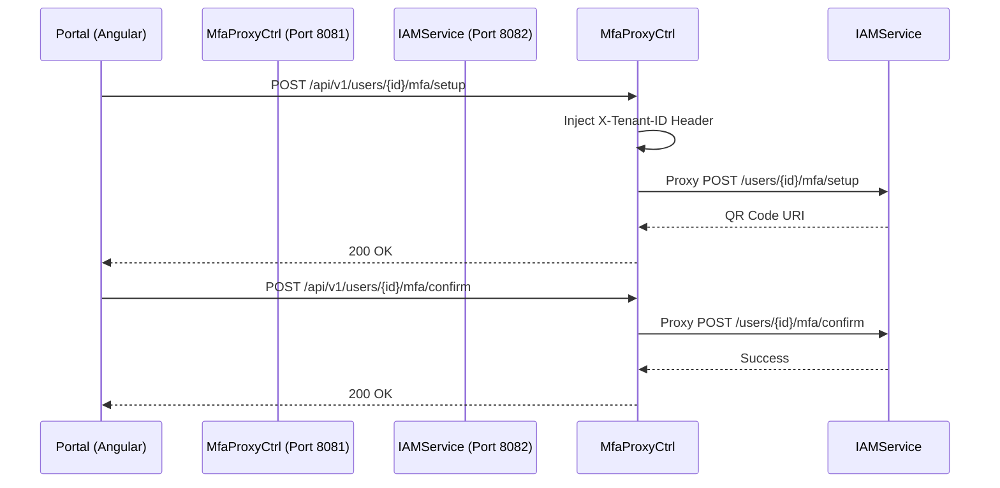

# MfaProxyController E2E Architecture Flow

## Overview
The `MfaProxyController` (located in `auth-server-core` on Port 8081) acts as a reverse proxy for MFA-related REST API calls originating from the Tenant Portal. It forwards these requests to the internal `auth-iam-service` (Port 8082).

## The Architectural Context
- The Angular Tenant Portal is configured to make all API calls to a single backend origin (Port 8081).
- However, MFA logic and Tenant Settings logic live entirely in the isolated `auth-iam-service`.
- This controller provides a seamless path for the frontend to manage MFA state without needing direct network access to the IAM microservice.

## Flow Diagram & Description

### 1. MFA Setup (`POST /{tenantId}/api/v1/users/{userId}/mfa/setup`)
- **Action:** Called by the Portal when a user clicks "Enable MFA".
- **Proxying:** Sets the `TenantContextHolder` and forwards the request to `IamServiceClient.setupMfa()`. Returns the QR Code URI to the frontend.

### 2. MFA Confirmation (`POST /{tenantId}/api/v1/users/{userId}/mfa/confirm`)
- **Action:** Called when the user submits their first 6-digit code to activate MFA.
- **Proxying:** Forwards the code to `IamServiceClient.confirmMfa()`. Returns success/failure.

### 3. MFA Disabling (`POST /{tenantId}/api/v1/users/{userId}/mfa/disable`)
- **Action:** Called when the user wants to turn off MFA. Requires them to submit a valid 6-digit code first.
- **Proxying:** Forwards the code to `IamServiceClient.disableMfa()`. 

### 4. Tenant Settings Proxying (`/api/v1/settings/*`)
- **Action:** The controller also proxies calls for retrieving and updating tenant-wide MFA policies (`mfa_required_for_all`).
- **Proxying:** Forwards `GET` and `PUT` requests to `IamServiceClient.getTenantSettings()`, `getMfaPolicy()`, and `setMfaPolicy()`.

## Security Considerations
- **Authentication:** These endpoints are under the `/api/**` path in `auth-server-core`, which is configured as an OAuth2 Resource Server. Therefore, they inherently require a valid JWT Bearer token before the proxy logic is even reached.
- **Context Propagation:** The controller explicitly sets the `TenantContextHolder` from the URL path variable, ensuring the downstream Feign Client call includes the correct `X-Tenant-ID` header for database routing in the IAM service.

## Request to Response Design Flow

### 1. MFA Management Proxies

