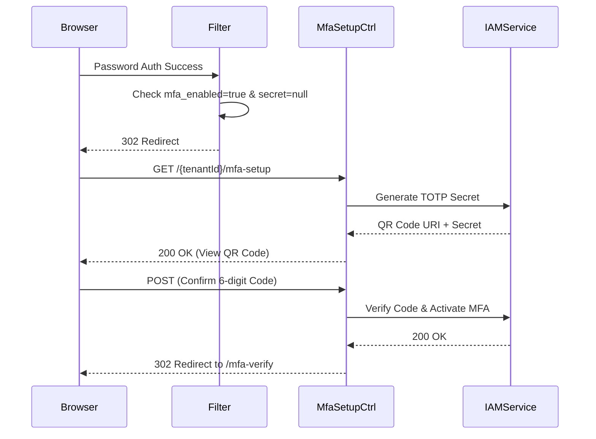

# MfaSetupController E2E Architecture Flow

## Overview
The `MfaSetupController` (located in `auth-server-core`) handles the presentation layer for enrolling a user in Time-Based One-Time Password (TOTP) Multi-Factor Authentication during their login flow.

## Flow Diagram & Description

### 1. The Intercept
- Similar to forced password changes, if a user successfully authenticates (via password) and the backend determines their account has `mfa_enabled = true` but they lack an `mfa_secret` in the database, their context is paused.
- Their identity is temporarily held in the `HttpSession` (`PENDING_MFA_USERNAME`), and they are redirected to `/{tenantId}/mfa-setup`.

### 2. Rendering the QR Code (`GET /{tenantId}/mfa-setup`)
- **Gate Check:** Validates the session attribute. If missing, redirect to `/login`.
- **Proxying:** The controller calls the IAM service (`IamServiceClient.setupMfa()`) to securely generate an encrypted TOTP secret and a QR Code data URI.
- **Result:** Renders the Thymeleaf view containing the scannable QR code and the raw base32 secret.

### 3. Processing Enrollment Confirmation (`POST /{tenantId}/mfa-setup`)
- **Action:** Captures the 6-digit TOTP code generated by the user's authenticator app.
- **Proxying:** Calls the IAM service to confirm the code against the newly generated secret.
- **Completion:** If the code is correct, the IAM service flips the `mfa_enabled` flag and persists the secret. The controller then redirects the user to `/{tenantId}/mfa-verify` (the challenge controller) to complete their MFA login.
- **Failure:** If incorrect, it fetches a fresh QR code from the IAM service and re-renders the setup page with an error.

## Security Considerations
- **No Local Secrets:** The TOTP secret generation, encryption, and storage happen entirely in the isolated `auth-iam-service`. This controller only handles the proxying and UI rendering.
- **Session Protection:** Eager CSRF token instantiation is required, and access is strictly gated by the `PENDING_MFA_USERNAME` session attribute to prevent arbitrary access.

## Request to Response Design Flow

### 1. Setup Intercept Flow

