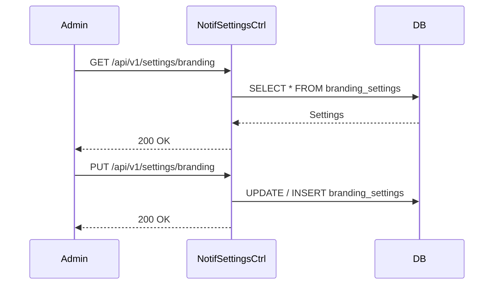
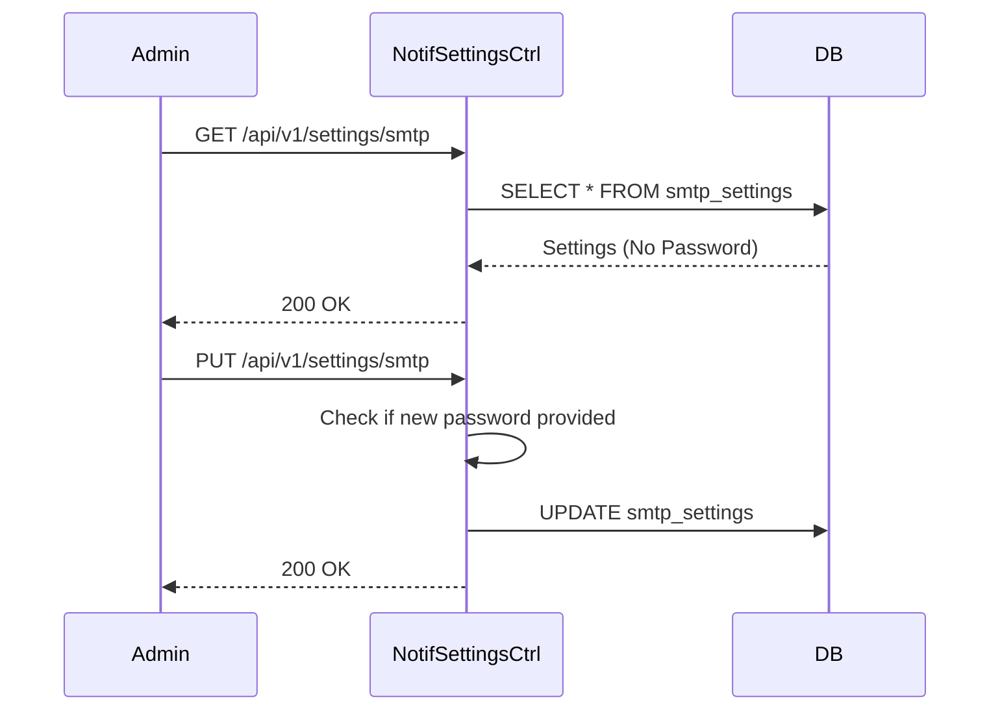

# TenantSettingsController (Notification Service) E2E Architecture Flow

## Overview
The `TenantSettingsController` (located in `auth-notification-service`) manages per-tenant configurations specifically related to external communications, such as white-label branding (logos, colors) and custom SMTP server details for transactional emails.

## Flow Diagram & Description

### 1. Branding Settings (`/api/v1/settings/branding`)
- **GET:** Retrieves the tenant's current branding configuration (`logoUrl`, `primaryColor`, `companyName`, etc.). If no custom settings exist, it returns default system values.
- **PUT:** Updates or creates the branding settings. These values are injected into the Thymeleaf email templates (e.g., the Password Reset email) to provide a white-labeled experience for the tenant's users.
- **DELETE:** Wipes the custom branding, reverting the tenant back to the platform defaults.

### 2. Custom SMTP Settings (`/api/v1/settings/smtp`)
- **GET:** Retrieves the tenant's custom SMTP server configuration (host, port, username, TLS settings). For security reasons, the raw password is never returned in the payload.
- **PUT:** Updates the SMTP credentials. 
  - *Logic:* The controller checks if a new password is provided in the DTO. If provided, it overwrites the existing password; if blank, it preserves the existing password in the database.
- **DELETE:** Wipes the custom SMTP configuration, causing the notification service to fall back to the platform's default mail server for this tenant's communications.

## Security Considerations
- **Credential Storage:** SMTP passwords represent highly sensitive credentials. While the controller currently saves them directly via the repository, production hardening requires these values to be encrypted at rest (e.g., using a symmetric encryption key or a Vault integration) before database persistence.
- **Authorization:** Modifying SMTP and branding settings is an administrative action. These endpoints must be protected by appropriate JWT scopes or RBAC roles to prevent standard users from altering outbound email flows.

## Request to Response Design Flow

### 1. Branding Settings

### 2. SMTP Settings

