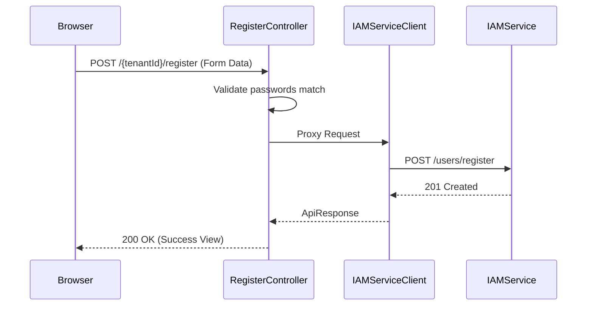

# RegisterController E2E Architecture Flow

## Overview
The `RegisterController` (located in `auth-server-core`) acts as a presentation-tier proxy. It serves the Thymeleaf-based sign-up UI and proxies form submissions downstream to the stateless `auth-iam-service`.

## Flow Diagram & Description

### 1. Rendering the Sign-Up Page (`GET /{tenantId}/register`)
- **Action:** Renders the `register.html` view. 
- **Session state:** It eagerly forces the creation of a Spring Security CSRF token to prevent "Cannot create a session after the response has been committed" errors, ensuring a stable form submission.

### 2. Handling Form Submission (`POST /{tenantId}/register`)
- **Action:** Captures the user's details (Email, First Name, Last Name, Password).
- **Local Validation:** Verifies that the `password` matches the `confirmPassword` field locally (these are never transmitted over the wire if they don't match).
- **Proxying:** Bundles the data into a JSON payload and transmits it to `auth-iam-service` via the OpenFeign client (`IamServiceClient.registerUser()`).
- **Response:** If successful, renders a "Check Your Email" confirmation view. If it fails (e.g. duplicate email), it re-renders the form with the error message from the IAM service.

### 3. Real-Time Availability Checks (`GET /{tenantId}/api/check-*`)
- **Action:** Lightweight AJAX endpoints called by frontend JavaScript to check if an `email` or `username` is already taken as the user is typing.
- **Proxying:** Calls the IAM service database to perform the uniqueness check.

### 4. Email Verification Proxy (`GET /{tenantId}/verify-email`)
- **Action:** When a user clicks the magic link in their registration email, it hits this endpoint.
- **Proxying:** Forwards the token to the IAM service for validation and status update, then renders a success or error view.

## Security Considerations
- **No Direct DB Access:** `auth-server-core` never touches the database directly for identity provisioning. It is strictly a frontend proxy for the IAM service.
- **Cross-Site Request Forgery (CSRF):** The controller relies on Spring Security's CSRF token management to ensure forms are submitted securely from the same origin.

## Request to Response Design Flow

### 1. Registration Flow

