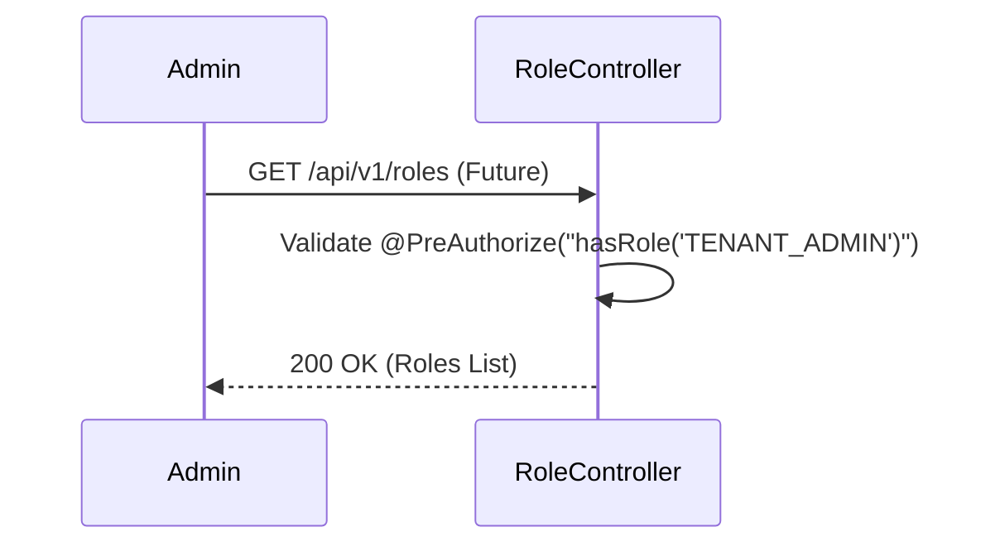

# RoleController E2E Architecture Flow

## Overview
The `RoleController` (located in `auth-iam-service`) is currently a placeholder scaffold intended for future Role-Based Access Control (RBAC) management features.

## Current State
- The controller class exists but contains no active endpoint implementations.
- It is mapped to the `AuthenzaConstant.API_VERSION + AuthenzaConstant.TENANT_PATH` endpoint base.

## Future Architecture (Phase 4 Roadmap)
When implemented, this controller will handle:
- **Custom Role Creation:** Allowing Tenant Admins to define custom roles (e.g., "Billing Admin", "Read-Only User").
- **Permission Mapping:** Linking standard granular authorities (e.g., `user:read`, `billing:write`) to custom roles.
- **Role Assignment:** Exposing APIs to assign roles to specific users in the `application_user` table.

## Security Considerations
- Once active, this controller will require strict `@PreAuthorize("hasRole('TENANT_ADMIN')")` guarding, as modifying RBAC structures is a highly sensitive tenant-level administrative operation.

## Request to Response Design Flow

### 1. Fetch Roles Flow (Future)

