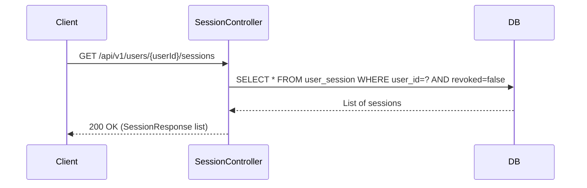
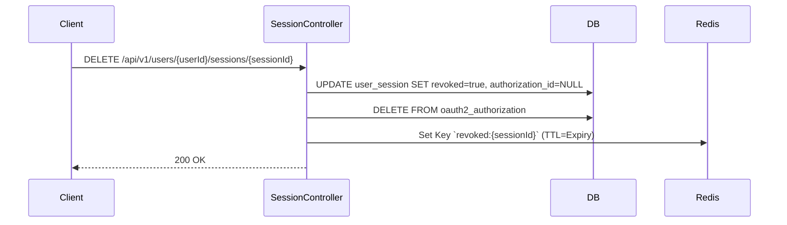

# SessionController E2E Architecture Flow

## Overview
The `SessionController` (located in `auth-iam-service`) manages the "Active Devices" feature. It provides REST APIs for users and administrators to view active login sessions across all devices and proactively revoke them, forcing an immediate logout for the targeted device.

## The Architectural Context
- **Stateless Tokens vs Stateful Sessions:** Standard OAuth2 JWT access tokens are stateless and cannot be revoked natively until they expire. To provide immediate revocation, Authenza uses a hybrid approach: JWTs contain a `session_id` claim linked to a stateful `user_session` database record.
- **Role in the System:** This controller is the API surface for querying that database and publishing revocation events to a Redis blacklist.

## Flow Diagram & Description

### 1. Listing Active Sessions (`GET /api/v1/users/{userId}/sessions`)
- **Trigger:** A user navigates to the "Active Devices" or "Security" tab in the Tenant Portal.
- **Action:** The controller delegates to `SessionService.listActiveSessions(userId)`.
- **Database Query:** The service executes a JDBC query (`SELECT * FROM user_session WHERE user_id = ? AND revoked = false`), returning all non-revoked sessions.
- **Data Enrichment:** The response includes the `ipAddress`, parsed `deviceName` (e.g., "Chrome on macOS"), and timestamps (`createdAt`, `lastActiveAt`). It also flags the `current: true` session by matching the `sessionId` extracted from the caller's JWT.

### 2. Revoking a Single Session (`DELETE /api/v1/users/{userId}/sessions/{sessionId}`)
- **Trigger:** A user clicks "Sign Out" on a specific device in the list, or an Admin forces a user logout.
- **Action:** The controller calls `SessionService.revokeSession(userId, sessionId)`.
- **Database Operations:**
  1. **Mark Revoked:** Updates the `user_session` row, setting `revoked = true` and `revoked_at = NOW()`.
  2. **Unlink Authorization:** Sets `authorization_id = NULL` on the session row. This is critical for handling orphaned re-auth tokens (silent token renewals after a session is revoked).
  3. **Delete OAuth2 Grant:** Deletes the corresponding `oauth2_authorization` row. This instantly destroys the OAuth2 Refresh Token, preventing the client from minting new access tokens.
- **Redis Blacklisting (The Instant Kill):**
  - Even though the refresh token is destroyed, the short-lived JWT Access Token is still valid.
  - The service takes the `sessionId` and writes it to Redis (via `RevokedSessionStore`) with a TTL matching the token's expiration.
  - **Result:** The `RevokedSessionJwtValidator` running inside the IAM service's `JwtDecoder` checks this Redis cache on *every* API request. If it finds the `session_id`, it immediately throws an HTTP 401 Unauthorized, logging the user out mid-session.

### 3. Revoking All Sessions (`DELETE /api/v1/users/{userId}/sessions`)
- **Trigger:** A user clicks "Sign out everywhere" (e.g., after a suspected breach).
- **Action:** Functions identically to single-session revocation, but iterates over all active sessions for the `userId`, updating the database and writing every `sessionId` to the Redis blacklist.

## Security Considerations
- **Resource Server Protection:** The entire `auth-iam-service` is an OAuth2 Resource Server. These endpoints require a valid JWT Bearer token.
- **Ownership & RBAC (Phase 4 Prerequisite):** Currently, the endpoints are protected by a global `.authenticated()` rule. In Phase 4, strict `@PreAuthorize("principal.id == #userId or hasRole('TENANT_ADMIN')")` expressions must be uncommented. Without this, any authenticated user could technically list or revoke sessions for another user by guessing their `userId`. This is a strict prerequisite before enabling third-party API integrations.

## Request to Response Design Flow

### 1. List Active Sessions

### 2. Revoke Single Session

