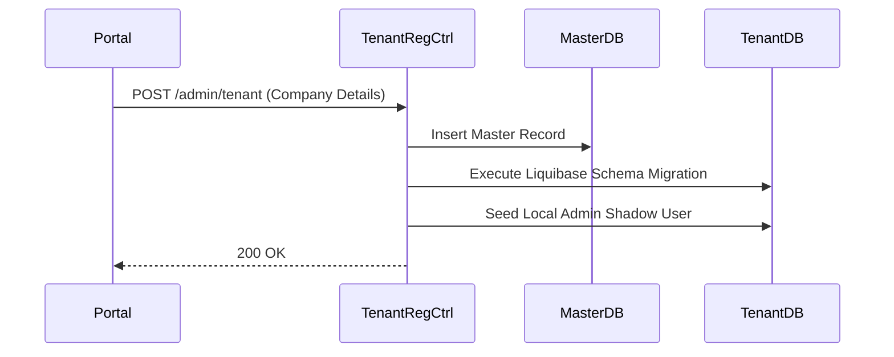
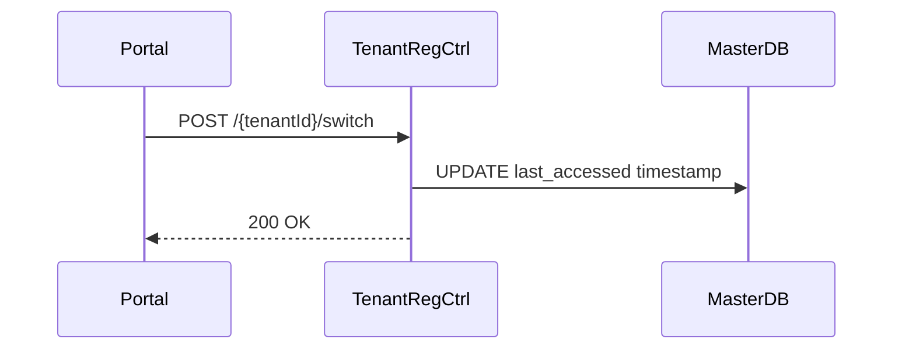

# TenantRegistrationController E2E Architecture Flow

## Overview
The `TenantRegistrationController` (located in `auth-master-service`) acts as the entry point for the SaaS "Tenant Onboarding" flow. It handles the creation of new tenant organizations, provisions isolated databases/schemas for them, and manages cross-tenant context switching for users who belong to multiple organizations (Phase 9 capability).

## Flow Diagram & Description

### 1. Registering a New Tenant (`POST /api/v1/admin/tenant`)
This endpoint is called by the `authenza-tenant-portal` when a user completes the "Create Organization" form (e.g., entering Company Name, Company Size, etc.).

- **Action:** The controller receives a `TenantRequest` payload containing the tenant details and the `ownerId` (the global account ID of the user creating the tenant).
- **Service Delegation:** It calls `TenantProvisioningService.onboardNewTenant()`.
- **E2E Provisioning Flow:**
  1. **Master DB Record:** Creates a new row in the `master` database tracking the tenant metadata (ID, name, status, owner).
  2. **Schema Migration:** Connects to the database server and executes Liquibase migrations to create a brand new, physically isolated database (or schema) dedicated entirely to this tenant.
  3. **The "Onboarding Bridge":** To allow the creator to log in, it establishes a "local shadow" record. It creates a `User` record inside the newly provisioned tenant database, linked to the `ownerId`.
  4. **Role Assignment:** It assigns the `TENANT_ADMIN` role to this new local user, ensuring the creator has full administrative rights from day one.
  5. **Default Settings:** Seeds the tenant database with default configurations (e.g., Session TTL, MFA policies).

### 2. Fetching User Tenants (`GET /api/v1/admin/tenant`)
- **Action:** Called by the portal to list all organizations a user belongs to.
- **Query:** Looks up the `master` database by `ownerId` and returns a list of tenants (e.g., "Acme Corp", "Beta LLC").
- **Use Case:** Populates the "Switch Organization" dropdown in the frontend UI.

### 3. Switching Context (`POST /api/v1/admin/tenant/{tenantId}/switch`)
- **Action:** Allows a user to switch their active session from one tenant to another.
- **Update:** Updates the `last_accessed` timestamp in the master database for that tenant-user linkage.
- **Future State (Phase 9):** This endpoint will eventually trigger an OAuth2 token refresh to exchange a token scoped for Tenant A into a token scoped for Tenant B, enforcing strict cross-tenant isolation.

## Security Considerations
- **Master Service Isolation:** This controller lives in `auth-master-service`, which connects to the highly sensitive `master` database. It deliberately does not run in `auth-iam-service` (which connects to tenant-specific databases) to prevent any possibility of cross-tenant data spillage.
- **SOC2 Hardening (Phase 5):** Currently, these endpoints are lightly protected. In Phase 5, `auth-master-service` will be upgraded to a strict OAuth2 Resource Server, requiring Machine-to-Machine (M2M) `client_credentials` tokens from `auth-server-core` with the `system-admin` scope to invoke these provisioning routes.

## Request to Response Design Flow

### 1. Tenant Provisioning

### 2. Context Switching

