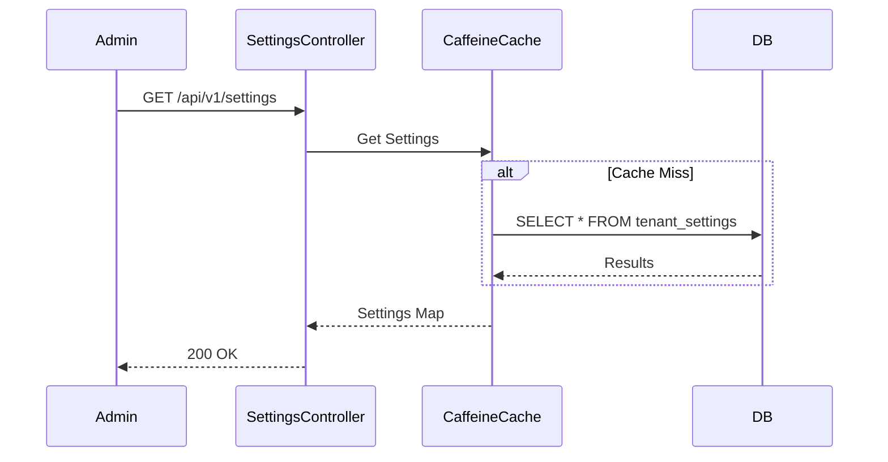
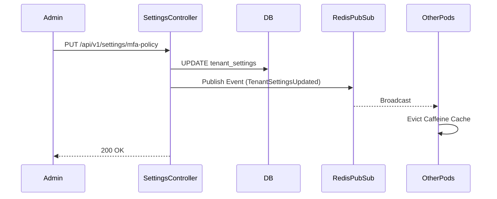

# TenantSettingsController (IAM Service) E2E Architecture Flow

## Overview
The `TenantSettingsController` (located in `auth-iam-service`) manages dynamic, per-tenant configurations such as security policies, MFA enforcement, and session lifecycles.

## Flow Diagram & Description

### 1. Retrieving Settings (`GET /api/v1/settings`)
- **Action:** Fetches all configuration keys and values for the active tenant.
- **Backend:** Calls `TenantSettingsService.getAllSettings()`, which reads from the isolated tenant database. These settings are heavily cached using Caffeine and Redis Pub/Sub to ensure high performance during the login flow.

### 2. Retrieving MFA Policy (`GET /api/v1/settings/mfa-policy`)
- **Action:** Specifically queries the `mfa_required_for_all` boolean setting.
- **Use Case:** Used by the Tenant Portal to display the toggle switch state in the Security Settings UI.

### 3. Updating MFA Policy (`PUT /api/v1/settings/mfa-policy`)
- **Action:** Updates the tenant-wide MFA enforcement flag.
- **Effect:** If set to `true`, the `MfaAuthenticationFilter` in the auth server will force *every* user in this tenant to complete an MFA challenge upon login, overriding their individual `mfa_enabled` preferences. If a user lacks a registered TOTP secret, they will be forced through the setup flow first.

### 4. Bulk Settings Update (`PUT /api/v1/settings`)
- **Action:** Accepts a JSON key-value map to bulk update arbitrary settings (e.g., `session_ttl_days`, `password_expiry_days`).
- **Backend:** Iterates over the map and updates the database records. Changes to these settings trigger a Redis Pub/Sub invalidation event, ensuring all clustered instances drop their Caffeine cache and read the fresh policy.

## Security Considerations
- **Authorization:** These endpoints modify tenant-wide security postures. In Phase 4, they must be strictly protected by `@PreAuthorize("hasAuthority('sec:settings:write')")` to ensure only Tenant Administrators can alter them.
- **Cache Coherency:** Because the `auth-server-core` relies on these settings to make real-time security decisions (e.g., should I prompt for MFA?), the Redis Pub/Sub invalidation architecture is critical to ensure a policy change is enforced instantly across the entire platform.

## Request to Response Design Flow

### 1. Fetching Settings

### 2. Updating Policy & Cache Invalidation

