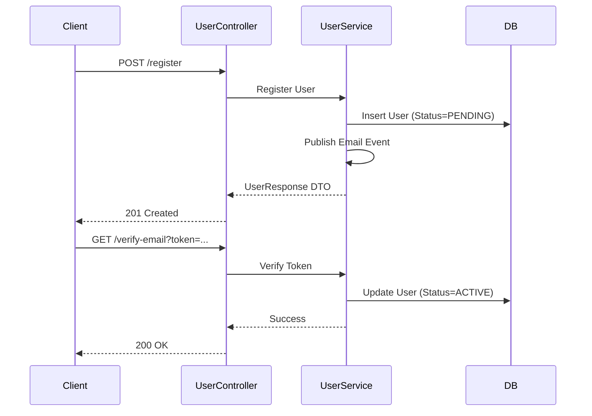
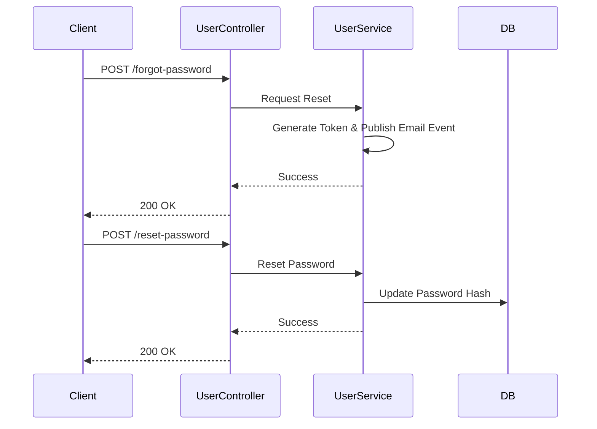
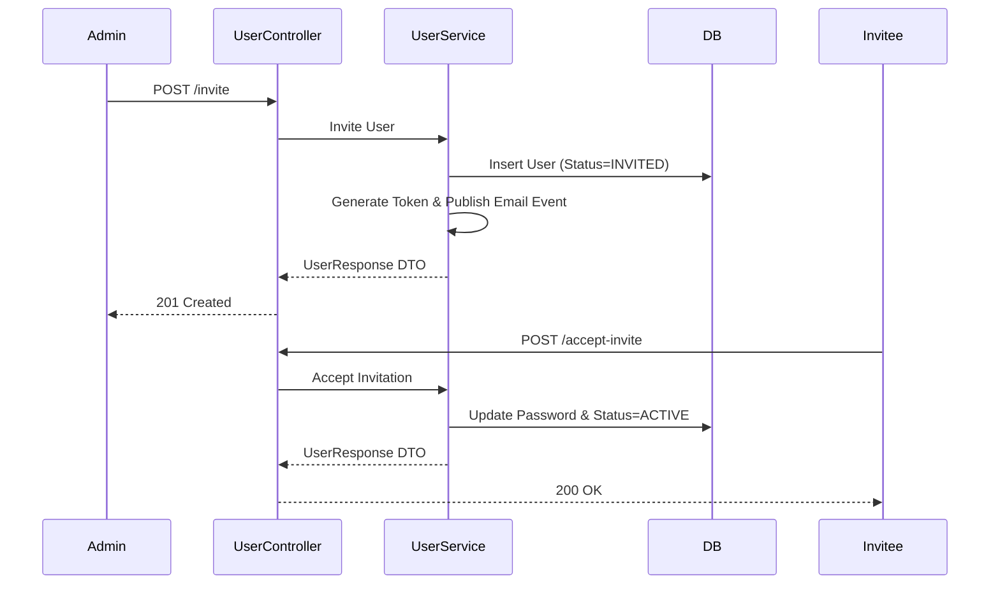
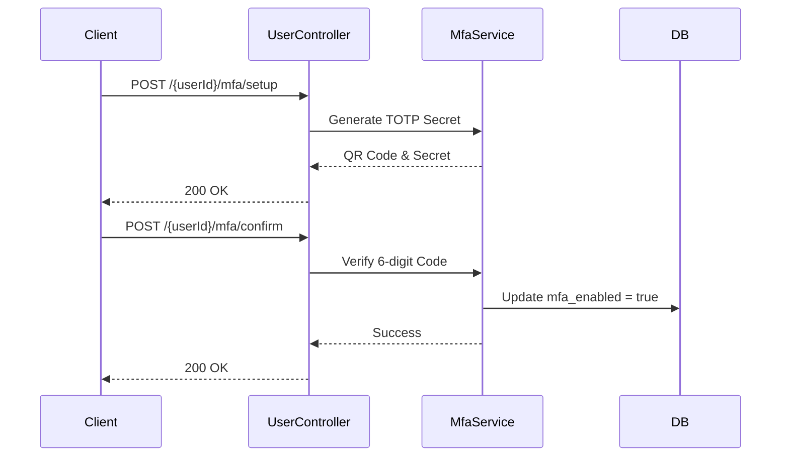

# UserController E2E Architecture Flow

## Overview
The `UserController` (located in `auth-iam-service`) is the primary interface for identity management. It handles the complete lifecycle of a user account: registration, password resets, profile updates, administration (MFA, account lockouts), and account deletion.

## The Architectural Context
As a core component of the `auth-iam-service`, this controller acts as an OAuth2 Resource Server. With the exception of public pre-login endpoints (like `/register` or `/forgot-password`), all endpoints require a valid JWT Access Token. It interacts directly with the `application_user` and `mfa_credential` tables in the tenant's isolated database.

## Flow Diagram & Description

### 1. Public Registration & Verification
- **`POST /register`**: Receives a `UserRegistrationRequest`. The `UserService` creates the user with a `PENDING` status, hashes the password, and triggers an asynchronous `EmailVerificationEvent`. 
- **`GET /check-email` & `/check-username`**: Lightweight endpoints used by frontend registration forms for real-time validation without submitting the full form.
- **`GET /verify-email`**: Completes the loop. When a user clicks the link in their email, this endpoint validates the token and flips the user status to `ACTIVE`.

### 2. Password Recovery (Self-Service)
- **`POST /forgot-password`**: The user submits their email. The service generates a secure, time-limited token and publishes a password reset event. *Security Note: Always returns 200 OK to prevent email enumeration.*
- **`GET /validate-reset-token`**: Used by the frontend to ensure the token from the email is still valid before rendering the "New Password" form.
- **`POST /reset-password`**: Consumes the valid token and updates the password hash in the database.

### 3. Administrator & B2B Flows
- **`POST /create`**: Allows a Tenant Admin to directly provision a new active user.
- **`POST /invite`**: The core B2B flow. Creates a user in an `INVITED` state and emails them a secure, one-time link.
- **`POST /accept-invite`**: Consumes the invitation token, allows the user to set their password, and activates the account.

### 4. Profile & Account Management (Authenticated)
- **`GET /{userId}/profile`**: Returns the user's non-sensitive profile details (name, avatar, etc.).
- **`PUT /{userId}/profile`**: Updates standard profile fields.
- **`POST /{userId}/change-password`**: Self-service password change. Requires the current password for verification.
- **`POST /{userId}/force-change-password`**: Executed during the login flow when an admin has flagged the account (`requires_password_change=true`).
- **`DELETE /{userId}`**: Self-service GDPR/CCPA account deletion. Wipes the user and all cascading data (sessions, WebAuthn credentials, MFA secrets).

### 5. Multi-Factor Authentication (MFA)
- **`POST /{userId}/mfa/setup`**: Generates a TOTP secret and a QR Code URI. The MFA is *not* enforced yet.
- **`POST /{userId}/mfa/confirm`**: Verifies the first 6-digit code against the secret. If successful, `mfa_enabled` is set to `true`.
- **`POST /{userId}/mfa/disable`**: Turns off MFA, requiring a valid TOTP code to prevent unauthorized removal.

## Security Considerations
- **Resource Server Protection:** The IAM service is protected by `IamSecurityConfig`. Sensitive endpoints are secured via JWTs.
- **RBAC (Phase 4):** Operations like `/create`, `/invite`, and `/unlock` currently rely on application-level trust but are slated in Phase 4 to require strict `@PreAuthorize("hasRole('TENANT_ADMIN')")` checks.
- **Ownership Checks:** Endpoints involving `{userId}` (like `/profile`, `/mfa/setup`, `/change-password`) require the caller to either own the resource (`principal.id == #userId`) or hold administrative privileges.

## Request to Response Design Flow

### 1. Registration & Verification Flow

### 2. Password Recovery Flow

### 3. B2B Administrator Invitation Flow

### 4. MFA Setup & Management Flow

