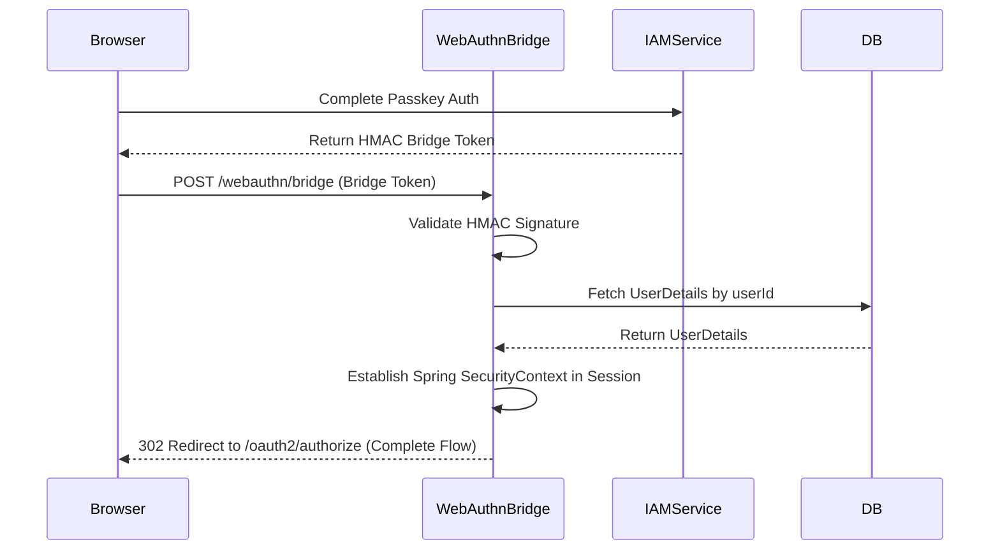

# WebAuthnBridgeController E2E Architecture Flow

## Overview
The `WebAuthnBridgeController` (located in `auth-server-core`) is a critical component that bridges the gap between the stateless WebAuthn verification service (`auth-iam-service`) and the stateful OAuth2 authorization session (`auth-server-core`). It allows a successful passkey authentication to translate into a full Spring Security session.

## The Architectural Challenge
- The FIDO2/WebAuthn cryptographic ceremony runs in `auth-iam-service` (Port 8082) because it requires access to the `webauthn_credential` table and the Yubico WebAuthn library.
- The OAuth2 OIDC flow (the `SecurityContext` and the `HttpSessionRequestCache`) lives in `auth-server-core` (Port 8081).
- **The Problem:** How does a successful passkey verification on Port 8082 result in the user being logged in on Port 8081?

## Flow Diagram & Description

### 1. The Bridge Token Handoff (`POST /{tenantId}/webauthn/bridge`)
After the frontend successfully verifies a passkey assertion with `auth-iam-service`, the IAM service issues a **Bridge Token**. This is a short-lived (60 seconds), HMAC-SHA256 signed string containing the `userId` and `tenantId`. The frontend JavaScript POSTs this token to `WebAuthnBridgeController.completeBridgeLogin()`.

### 2. Token Validation & Signature Check
- **Action:** The controller splits the Bridge Token and verifies the HMAC signature using a shared `bridgeSecret` (configured via `app.webauthn.bridge-secret`).
- **Security:** It uses a constant-time string comparison (`constantTimeEquals`) to mitigate cryptographic timing attacks.
- **Expiry:** It checks the 60-second TTL embedded in the token payload to prevent replay attacks. If the token is expired, invalid, or belongs to the wrong tenant, the user is redirected back to `/login?error`.

### 3. Identity Resolution & State Check
- **Action:** Using the `userId` from the verified token, the controller invokes `JdbcTenantUserDetailsService` to perform a reverse lookup to find the user's `username`.
- **Validation:** It loads the full `UserDetails` object and verifies that the account is active, enabled, and not locked (e.g., by the `BruteForceProtectionService`). If locked, it redirects to `/login?locked`.

### 4. Session Establishment (The "Bridge")
This is the core purpose of the controller.
- **Action:** It manually constructs a Spring Security `UsernamePasswordAuthenticationToken` using the loaded `UserDetails` and authorities.
- **Context Injection:** It creates an empty `SecurityContext`, injects the authentication token, and sets it on the `SecurityContextHolder`.
- **Persistence:** Crucially, it saves this context into the raw HTTP session (`HttpSessionSecurityContextRepository.SPRING_SECURITY_CONTEXT_KEY`). This identically mimics what Spring Security's native form-login filter does when a user submits a valid password.

### 5. Active Devices Session Recording
- **Action:** It calls `SessionRecordingService.recordSession()` to parse the `User-Agent` and `IP Address` and log this new login event into the `user_session` table, ensuring the WebAuthn login appears in the user's "Active Devices" list.

### 6. OIDC Flow Completion
- **Action:** It checks the `HttpSessionRequestCache` for a pending `SavedRequest` (the original `/oauth2/authorize` call that started the login process).
- **Redirection:** It redirects the browser to that saved URL. Spring Security now sees the established `SecurityContext`, realizes the user is authenticated, and automatically completes the OAuth2 authorization code grant, issuing an authorization code back to the client application.

## Security Considerations
- **No Shared Database State:** By using an HMAC-signed token, the two microservices do not need to share a database table or Redis cache just to pass the authentication result.
- **Deny-by-Default:** The bridge token endpoint is `permitAll()`, meaning anyone can hit it, but without the exact HMAC signature generated by the IAM service, it instantly rejects the payload.
- **Requires Password Change Gap (Pending Sprint 10):** Currently, this controller bypasses the `isPasswordChangeRequired()` check that exists in the form login flow. This is documented in Phase 2 of the Roadmap to be fixed by injecting a gate check before step 4.

## Request to Response Design Flow

### 1. Session Bridge Flow

