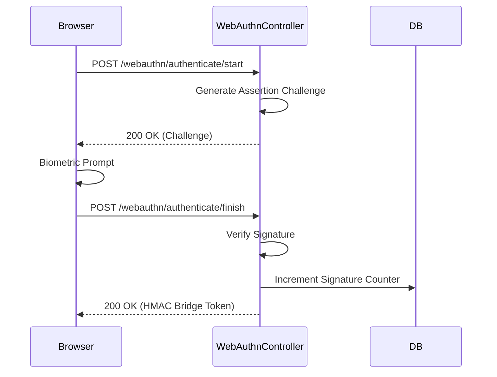
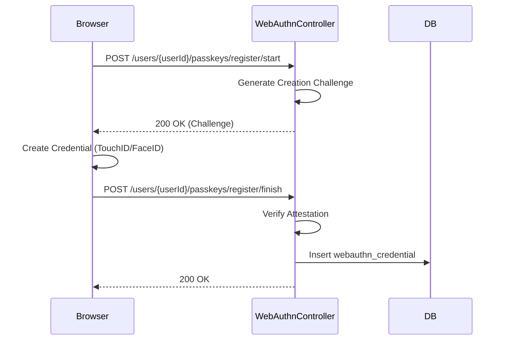
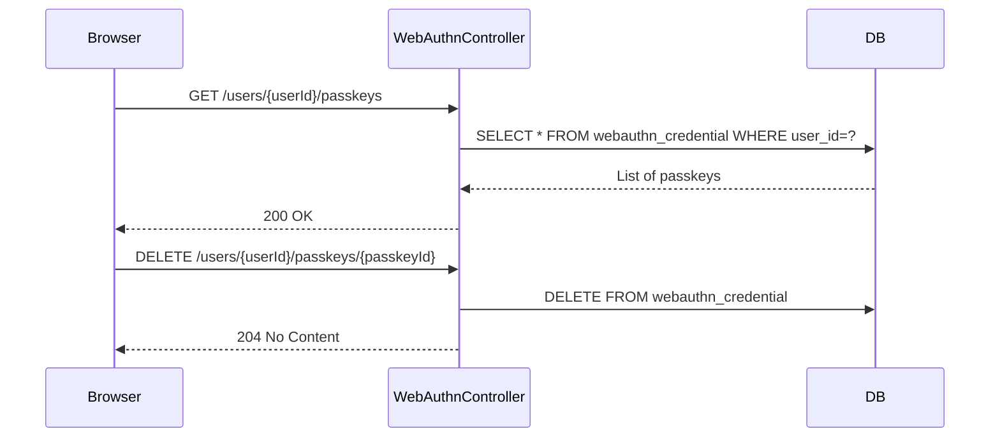

# WebAuthnController E2E Architecture Flow

## Overview
The `WebAuthnController` (located in `auth-iam-service`) manages the FIDO2/WebAuthn (Passkey) lifecycle. It orchestrates the complex cryptographic ceremonies required for both registering a new hardware passkey to a user's account and using an existing passkey for passwordless authentication.

## The Architectural Context
WebAuthn is inherently a two-step process for both registration and authentication. The backend must first generate a cryptographic "challenge" (Step 1), pass it to the browser's `navigator.credentials` API, and then verify the signed response (Step 2). This controller relies heavily on the `yubico/webauthn-server-core` library.

## Flow Diagram & Description

### 1. Passwordless Authentication Flow (Unauthenticated)
These endpoints are called directly from the login page *before* a user is logged in. They are marked `permitAll()`.

- **Step 1: `POST /webauthn/authenticate/start`**
  - **Action:** The user enters their username. The controller asks `WebAuthnService` to generate an assertion challenge.
  - **Result:** Returns the challenge, the relied party (RP) ID, and the allowed credentials (the passkeys registered to that user) to the browser.
- **Step 2: `POST /webauthn/authenticate/finish`**
  - **Action:** The browser prompts the user for biometrics (TouchID, Windows Hello), signs the challenge, and sends the payload back.
  - **Verification:** The service cryptographically verifies the signature against the stored public key, increments the signature counter (to prevent replay attacks), and validates the origin.
  - **The Bridge:** If successful, the IAM service generates a short-lived, HMAC-signed "Bridge Token".
  - **Handoff:** The browser receives this token and immediately POSTs it to the `auth-server-core`'s `WebAuthnBridgeController` to establish the actual OAuth2/Spring Security session.

### 2. Passkey Registration Flow (Authenticated)
These endpoints are called from the "Security" tab in the Tenant Portal. They require a valid JWT Access Token.

- **Step 1: `POST /users/{userId}/passkeys/register/start`**
  - **Action:** The controller asks the service to generate a `PublicKeyCredentialCreationOptions` challenge for the specific user.
  - **Result:** The browser uses this to prompt the user to create a new passkey (e.g., saving it to iCloud Keychain or a YubiKey).
- **Step 2: `POST /users/{userId}/passkeys/register/finish`**
  - **Action:** The browser sends the newly generated public key and the signed attestation back to the server.
  - **Storage:** The service verifies the attestation and persists the public key, credential ID, and signature counter into the `webauthn_credential` table.

### 3. Passkey Management (Authenticated)
- **`GET /users/{userId}/passkeys`**: Retrieves a list of all passkeys registered to the user (excluding the raw public key material) to display in the UI.
- **`PATCH /users/{userId}/passkeys/{passkeyId}`**: Allows the user to rename a passkey (e.g., from generic "TouchID" to "Personal MacBook") for easier management.
- **`DELETE /users/{userId}/passkeys/{passkeyId}`**: Deletes the passkey from the database. Once deleted, that specific device can no longer be used for passwordless login.

## Security Considerations
- **Cryptographic Trust:** The controller never sees or stores private keys. It only stores the public key and relies on standard asymmetric cryptography to verify that the user possesses the private key.
- **Origin Validation:** The WebAuthn configuration strictly validates the `Origin` header against the expected Relying Party ID (the tenant's domain) to prevent phishing and Man-in-the-Middle (MitM) attacks.
- **Endpoint Separation:** Notice the strict separation of concerns: `/webauthn/**` is public and handles authentication, while `/users/*/passkeys/**` is private and handles management.

## Request to Response Design Flow

### 1. Passwordless Authentication Flow

### 2. Passkey Registration Flow

### 3. Passkey Management

